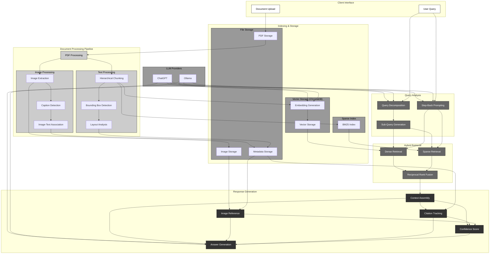

# Advanced RAG Implementation & Analysis Platform

A sophisticated platform for developing and analyzing RAG (Retrieval-Augmented Generation) implementations. Built with a focus on multi-modal document understanding, this tool combines advanced document processing, intelligent retrieval strategies, and comparative analysis across different LLM providers.

<div align="center">
  <svg xmlns="http://www.w3.org/2000/svg" viewBox="0 0 800 400">
    <svg viewBox="0 0 800 400" xmlns="http://www.w3.org/2000/svg">
<!-- Background -->
  <rect width="800" height="400" fill="#ffffff"/>

  <!-- Document Understanding -->
  <rect x="50" y="50" width="240" height="300" fill="#f8f9fa" stroke="#666" rx="5"/>
  <text x="70" y="80" font-family="Arial" font-size="14" font-weight="bold">Enhanced Context Understanding</text>

  <!-- Document elements -->
  <rect x="70" y="100" width="200" height="60" fill="#fff" stroke="#666" rx="3"/>
  <text x="85" y="130" font-family="Arial" font-size="12">Spatial Layout Analysis</text>
  <text x="85" y="145" font-family="Arial" font-size="10" fill="#666">Text and image positioning</text>

  <rect x="70" y="170" width="200" height="60" fill="#fff" stroke="#666" rx="3"/>
  <text x="85" y="200" font-family="Arial" font-size="12">Visual Element Processing</text>
  <text x="85" y="215" font-family="Arial" font-size="10" fill="#666">Images, tables, diagrams</text>

  <rect x="70" y="240" width="200" height="60" fill="#fff" stroke="#666" rx="3"/>
  <text x="85" y="270" font-family="Arial" font-size="12">Hierarchical Text Analysis</text>
  <text x="85" y="285" font-family="Arial" font-size="10" fill="#666">Structure-aware chunking</text>

  <!-- Intelligent Retrieval -->
  <rect x="320" y="50" width="240" height="300" fill="#f8f9fa" stroke="#666" rx="5"/>
  <text x="340" y="80" font-family="Arial" font-size="14" font-weight="bold">Intelligent Retrieval</text>

  <rect x="340" y="100" width="200" height="60" fill="#fff" stroke="#666" rx="3"/>
  <text x="355" y="130" font-family="Arial" font-size="12">Multi-Stage Query Processing</text>
  <text x="355" y="145" font-family="Arial" font-size="10" fill="#666">Query decomposition & expansion</text>

  <rect x="340" y="170" width="200" height="60" fill="#fff" stroke="#666" rx="3"/>
  <text x="355" y="200" font-family="Arial" font-size="12">Hybrid Search</text>
  <text x="355" y="215" font-family="Arial" font-size="10" fill="#666">Dense + sparse retrieval fusion</text>

  <rect x="340" y="240" width="200" height="60" fill="#fff" stroke="#666" rx="3"/>
  <text x="355" y="270" font-family="Arial" font-size="12">Context Assembly</text>
  <text x="355" y="285" font-family="Arial" font-size="10" fill="#666">Smart information synthesis</text>

  <!-- Response Generation -->
  <rect x="590" y="50" width="160" height="300" fill="#f8f9fa" stroke="#666" rx="5"/>
  <text x="610" y="80" font-family="Arial" font-size="14" font-weight="bold">Enhanced Response</text>

  <rect x="610" y="100" width="120" height="60" fill="#fff" stroke="#666" rx="3"/>
  <text x="625" y="130" font-family="Arial" font-size="12">Visual Integration</text>
  <text x="625" y="145" font-family="Arial" font-size="10" fill="#666">Relevant images</text>

  <rect x="610" y="170" width="120" height="60" fill="#fff" stroke="#666" rx="3"/>
  <text x="625" y="200" font-family="Arial" font-size="12">Source Tracking</text>
  <text x="625" y="215" font-family="Arial" font-size="10" fill="#666">Precise citations</text>

  <rect x="610" y="240" width="120" height="60" fill="#fff" stroke="#666" rx="3"/>
  <text x="625" y="270" font-family="Arial" font-size="12">Quality Control</text>
  <text x="625" y="285" font-family="Arial" font-size="10" fill="#666">Confidence scoring</text>

  <!-- Connecting arrows -->
  <path d="M290 200 L320 200" stroke="#666" fill="none" marker-end="url(#arrow)"/>
  <path d="M560 200 L590 200" stroke="#666" fill="none" marker-end="url(#arrow)"/>

  <!-- Arrow marker definition -->
  <defs>
    <marker id="arrow" markerWidth="10" markerHeight="10" refX="9" refY="5" orient="auto">
      <path d="M0,2 L8,5 L0,8" fill="none" stroke="#666"/>
    </marker>
  </defs>
</svg>
  </svg>
</div>

## Key Features

### Intelligent Document Processing
- Multi-modal processing combining text, tables, and images
- Spatial analysis for layout understanding
- Automatic image-text correlation and caption detection
- Hierarchical document segmentation with context preservation

### Advanced Retrieval System
- Hybrid search combining dense embeddings and BM25
- Multi-stage query decomposition
- Step-back prompting for broader context
- Intelligent result reranking using reciprocal rank fusion

### Flexible Provider Architecture
- Support for OpenAI and Ollama (Claude coming soon)
- Provider-specific embedding optimization
- Real-time performance analysis
- Comparative response evaluation

## Quick Start

### First-time Setup
```bash
docker compose up --build
```

### Subsequent Starts
```bash
docker compose up
```

Visit `http://localhost:3000` to access the application.

## Technical Architecture

### RAG Pipeline



## Detailed Features

### Document Understanding
- **Layout Analysis**: Preserves spatial relationships between text and visual elements
- **Image Processing**: Automatically extracts and associates images with relevant text
- **Table Detection**: Identifies and preserves tabular data structures
- **Metadata Tracking**: Maintains document structure and relationships


### Query Processing
- **Query Decomposition**: Breaks complex queries into manageable sub-queries
- **Context Expansion**: Uses step-back prompting for broader understanding
- **Multi-stage Retrieval**: Combines results from multiple retrieval strategies
- **Citation Tracking**: Maintains source attribution for all retrieved information


### Response Generation
- **Context Assembly**: Intelligently combines retrieved information
- **Image Integration**: Seamlessly incorporates relevant images and diagrams
- **Citation Management**: Provides detailed source tracking
- **Confidence Scoring**: Evaluates response reliability


## Important Usage Notes

### Document Processing

**⚠️ Important**: Document embeddings are provider-specific and are generated at upload time based on your current configuration.

- Documents are embedded using all currently configured providers
- Embedding model changes require document re-upload
- Provider configuration should precede document upload

### Storage Requirements
- Recommended: 15GB+ free space for document storage
- Additional space needed for embedding storage
- Consider storage requirements when processing large documents

## Configuration Guide

### OpenAI Setup
1. Obtain API key from platform.openai.com
2. Configure model and embedding model
3. Set temperature and other parameters
4. Save configuration

### Ollama Setup
1. Ensure Ollama is running (default: http://ollama:11434)
2. Select model (e.g., llama2, mistral)
3. Configure embedding model (e.g., nomic-embed-text)
4. Save configuration

## Performance Considerations

### Response Time Optimization
- Hybrid retrieval balances speed and accuracy
- Chunk size affects retrieval precision
- Provider selection impacts latency and cost

### Memory Management
- Monitor embedding storage growth
- Consider regular maintenance for optimal performance
- Balance chunk size with retrieval effectiveness

## Use Cases

### Document Analysis
- Research paper analysis
- Technical documentation understanding
- Multi-modal content processing

### Information Retrieval
- Complex query resolution
- Multi-document synthesis
- Visual information integration

### Comparative Analysis
- Provider performance evaluation
- Embedding model comparison
- Retrieval strategy optimization

## Technical Details

### Backend Architecture
- FastAPI for robust API handling
- Async processing for improved performance
- Modular design for provider integration

### Storage Layer
- ChromaDB for vector storage
- PostgreSQL for metadata and system state
- File system for document storage

### Frontend
- React with Next.js
- Real-time UI updates
- Responsive design

## Contributing
Contributions are welcome! Please read our [Contributing Guidelines](CLA.md) before submitting changes.

## License
This project is licensed under a Custom Non-Commercial License. See [LICENSE](LICENSE.md) for full details.

## Acknowledgments
- Anthropic, OpenAI, and the Ollama team for their excellent models
- The open-source community for various supporting libraries
- All contributors who have helped improve this project

