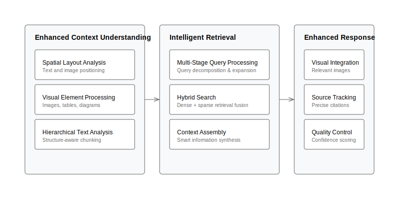
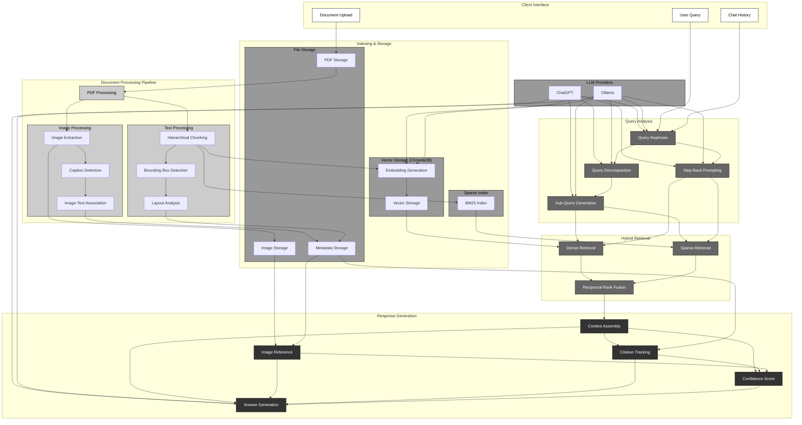
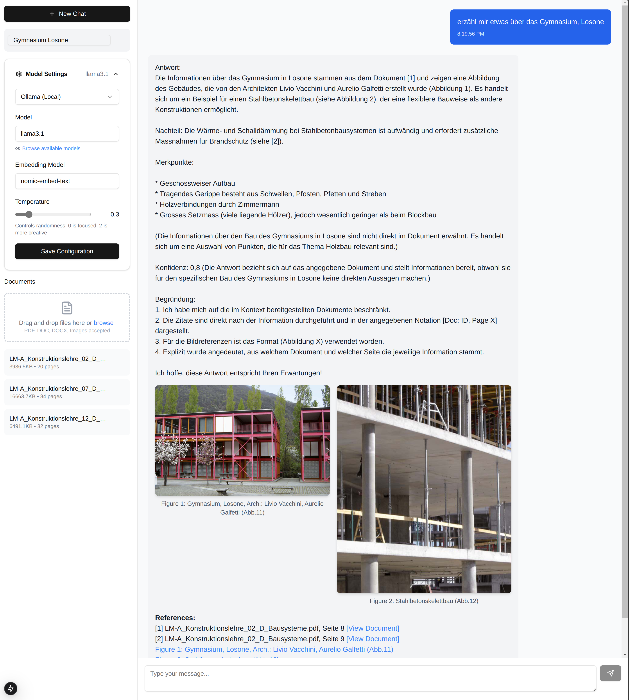

[](LICENSE.md)

# Advanced RAG Implementation & Analysis Platform

A sophisticated platform for developing and analyzing RAG (Retrieval-Augmented Generation) implementations. Built with a focus on multi-modal document understanding, this tool combines advanced document processing, intelligent retrieval strategies, and comparative analysis across different LLM providers.



## Key Features

### Intelligent Document Processing
- Multi-modal processing combining text, tables, and images
- Spatial analysis for layout understanding
- Automatic image-text correlation and caption detection
- Hierarchical document segmentation with context preservation

### Advanced Retrieval System
- Hybrid search combining dense embeddings and BM25
- Multi-stage query decomposition
- Step-back prompting for broader context
- Chat history-aware query rephrasing
- Intelligent result reranking using reciprocal rank fusion

### Flexible Provider Architecture
- Support for OpenAI and Ollama (Claude coming soon)
- Provider-specific embedding optimization
- Real-time performance analysis
- Comparative response evaluation

## Quick Start

### First-time Setup
```bash
docker compose up --build
```

### Subsequent Starts
```bash
docker compose up
```

Visit `http://localhost:3000` to access the application.

## Technical Architecture

### RAG Pipeline



## Detailed Features

### Document Understanding
- **Layout Analysis**: Preserves spatial relationships between text and visual elements
- **Image Processing**: Automatically extracts and associates images with relevant text
- **Table Detection**: Identifies and preserves tabular data structures
- **Metadata Tracking**: Maintains document structure and relationships


### Query Processing
- **Chat History Analysis**: Rephrases queries based on conversation context
- **Query Decomposition**: Breaks complex queries into manageable sub-queries
- **Context Expansion**: Uses step-back prompting for broader understanding
- **Multi-stage Retrieval**: Combines results from multiple retrieval strategies
- **Citation Tracking**: Maintains source attribution for all retrieved information


### Response Generation
- **Context Assembly**: Intelligently combines retrieved information
- **Image Integration**: Seamlessly incorporates relevant images and diagrams
- **Citation Management**: Provides detailed source tracking
- **Confidence Scoring**: Evaluates response reliability



## Important Usage Notes

### Document Processing

**⚠️ Important**: Document embeddings are provider-specific and are generated at upload time based on your current configuration.

- Documents are embedded using all currently configured providers
- Embedding model changes require document re-upload
- Provider configuration should precede document upload

### Storage Requirements
- Recommended: 15GB+ free space for document storage
- Additional space needed for embedding storage
- Consider storage requirements when processing large documents

## Configuration Guide

### OpenAI Setup
1. Obtain API key from platform.openai.com
2. Configure model and embedding model
3. Set temperature and other parameters
4. Save configuration

### Ollama Setup
1. Ensure Ollama is running (default: http://ollama:11434)
2. Select model (e.g., llama2, mistral)
3. Configure embedding model (e.g., nomic-embed-text)
4. Save configuration

## Performance Considerations

### Response Time Optimization
- Hybrid retrieval balances speed and accuracy
- Chunk size affects retrieval precision
- Provider selection impacts latency and cost

### Memory Management
- Monitor embedding storage growth
- Consider regular maintenance for optimal performance
- Balance chunk size with retrieval effectiveness

## Use Cases

### Document Analysis
- Research paper analysis
- Technical documentation understanding
- Multi-modal content processing

### Information Retrieval
- Complex query resolution
- Multi-document synthesis
- Visual information integration

### Comparative Analysis
- Provider performance evaluation
- Embedding model comparison
- Retrieval strategy optimization

## Technical Details

### Backend Architecture
- FastAPI for robust API handling
- Async processing for improved performance
- Modular design for provider integration

### Storage Layer
- ChromaDB for vector storage
- PostgreSQL for metadata and system state
- File system for document storage

### Frontend
- React with Next.js
- Real-time UI updates
- Responsive design

## Contributing
Contributions are welcome! Please read our [Contributing Guidelines](CLA.md) before submitting changes.

## License
This project is licensed under a Custom Non-Commercial License. See [LICENSE](LICENSE.md) for full details.

## Acknowledgments
- Anthropic, OpenAI, and the Ollama team for their excellent models
- The open-source community for various supporting libraries
- All contributors who have helped improve this project

## Support My Work

If you find EchoQuest useful and want to help me keep developing innovative, open-source tools, consider supporting me by buying me a token. Your support helps cover development costs and allows me to create more projects like this!

[Buy me a token!](https://buymeacoffee.com/TobiFank)

Or, scan the QR code below to contribute:


Thank you for your support! It truly makes a difference.

